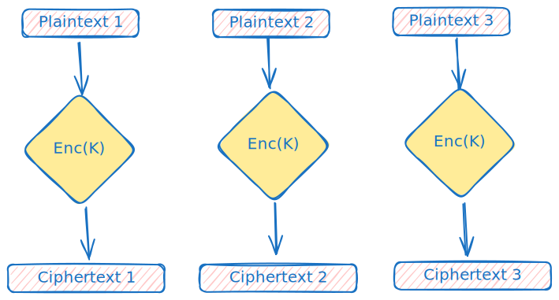
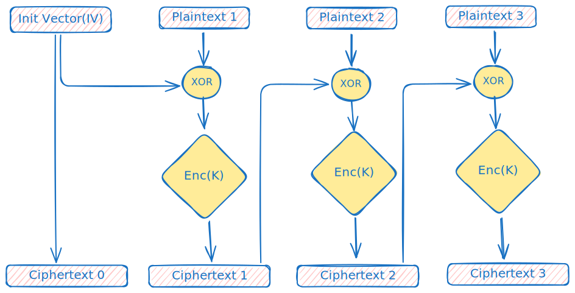
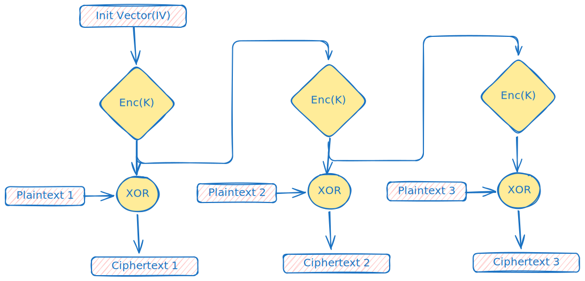
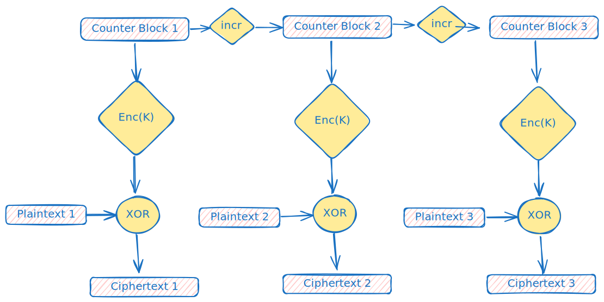

# Modes of Operation

Block ciphers can only do fixed length encryption of bits in a well-defined Block. Modes of operation allows to extend cipher's encryption/decryption algorithms to allow arbitrary length data.

Some operations require *Initialisation vector* (IV) that must not repeat for subsequent encryption operations, and must be random for some operations. IV is used so that different ciphertext is generated for same plaintext even for a single key. We demonstrate this in our [tests](./cbc.rs).

Appropriate padding has to be performed for some modes, as block ciphers only work of fixed size blocks. Since, most of the ciphers are used with [MAC](https://en.wikipedia.org/wiki/Message_authentication_code) that provides integrity guarantees and prevent Chosen-Ciphertext attacks on the protocol, so, [any](https://crypto.stackexchange.com/questions/62379/choice-of-padding-scheme-to-prevent-cbc-padding-oracle-attacks) padding scheme works, most common is PKCS#7 or even null byte padding. Note that, without use of MACs, almost all block ciphers with padding are susceptible to [Padding Oracle Attacks](https://en.wikipedia.org/wiki/Padding_oracle_attack) and should be handled with utmost care.

Let's go into detail about Block cipher's [mode of operation](https://en.wikipedia.org/wiki/Block_cipher_mode_of_operation):

## ECB: Electronic codebook (INSECURE)

The encryption operation in ECB can be viewed as,



- It is the simplest mode of encryption but is not secure.
- In this, we independently apply the block cipher on each block of plaintext. 
- The algorithm is deterministic, hence it is not secure against Chosen-plaintext Attack(CPA).
- It can be parallelized easily.

## CBC: Cipher Block Chaining

The encryption operation in CBC can be viewed as,



- It is a CPA-secure mode of operation.
- The first ciphertext block is called an Initialisation Vector(IV), which is chosen uniformly at random.
- It is defined as, $$C_{0}=IV, \quad C_{i}=Enc_{K}(C_{i-1} \oplus M_{i}) $$
where,
    + $C_{i}$ represents blocks of ciphertext.
    + $Enc_{K}$ is the block cipher with key $K$
    + $M_{i}$ represents the $i$-th plaintext block
    + and $i$ ranges from 1 to N, the number of blocks required by the plaintext.

- It is sequential in nature, although decryption can be parallelized as inputs to block cipher's encryption is just the ciphertext.
- **Chained CBC**: A variant of CBC where ciphertext is chained for subsequent encryptions.
  + But it's not CPA secure, as an attacker can distinguish between PRF and uniform random function by choosing appropriate text in second encryption.
  + See the [code example](../../../../examples/aes_chained_cbc.rs) that demonstrates this vulnerability!

## OFB: output feedback

The encryption operation in OFB can be viewed as,



- IV is chosen uniformly and $Y_{0}:=IV$, then $Y_{i}=Enc_{k}(Y_{i-1})$ and $C_{i}=Y_{i} \oplus M_{i}$.
- This allows $Enc_{k}$ to not be invertible, and can be simply a PRF.
- Due to this, OFB can be used to encrypt plaintext of arbitrary lengths and not have to be multiple of block length.
- Pseudorandom Stream can be preprocessed and then encryption can be really fast.
- It's stateful variant can be used to instantiate stream cipher's synchronised mode of operation and is secure.

## CTR: counter mode

The encryption operation in CTR can be viewed as,



- Like OFB, CTR converts a block cipher to a stream cipher. where the keystream, called the Counter Block, is generated using the nonce/IV concatenated with a counter, which is 
incremented for successive blocks.
- Thus, it can be viewed as unsynchronised stream cipher mode, where $Y_{i}=Enc_{K}(\langle IV \parallel i\rangle)$ for the binary string $i = 1,2,\dots,$ and $c_{i}=y_{i}\oplus m_{i}$.
- This again allows $Enc_{K}$ to not be invertible and can be instantiated with a Pseudorandom function.
- It can be fully parallelized.

## GCM: Galois/Counter Mode

GCM is a block cipher mode of operation that provides both confidentiality and authentication.
To provide confidentiality, it uses Counter(CTR) mode for encryption and decryption.
To provide authentication, it uses a universal hash function, GHASH.
Authentication is provided not only for confidential data but also other associated data.

In this section, we will give an informal overview of GCM mode for 128-bit block cipher.
*To see the formal definition of the operations of GCM, I recommend reading the original paper. [The Galois/Counter Mode of Operation (GCM)](https://csrc.nist.rip/groups/ST/toolkit/BCM/documents/proposedmodes/gcm/gcm-revised-spec.pdf)*

The two operations of GCM are authenticated encryption and authenticated decryption.

Here is a figure that gives a complete overview of the authenticated encryption in GCM. 

In the figure, we have taken
- the size of plaintext is `3 * 128-bit = 384 bits or 48 bytes`, 
- Additionally Authenticated Data(AAD) is of `2 * 128-bit = 248 bits or 32 bytes`.


*Note: The yellow diamonds represent functions/algorithms, the small rectangle with a blue outline represents 128-bit blocks.*
Also,
- *Enc(K)*: The encryption operation of the cipher used, for example AES, under the key K.
- *incr*: The increment function, which treats the rightmost 32-bit of the block as an unsigned integer and increments it by 1.

If you look at the figure carefully, you will notice that the GCM mode is composed of two main parts:
- Encryption: This part is the same as the CTR mode of operation, with minor changes to the counter block.
- Authentication: In this part, we generate an authentication tag for the ciphertext and some additional data, which we refer to as Additionally Authenticated Data(AAD).

The counter block is the same as in CTR mode. In general, it can be thought of as a 96-bit nonce value followed by a 32-bit counter value.

The tag is generated by XOR of:
1. Hash of ciphertext and AAD, using GHASH algorithm
2. Encryption of Counter block 0.

### GHASH

The GHASH algorithm can be viewed as a series of `ADD and MULTIPLY` in $GF(2^{128})$. Mathematically put the basic operation of GHASH is,

$$
X_{i} =
\begin{cases}
0  & \quad i = 0 \\
( X_{i-1} \oplus B_{i} ) * H & \quad \text{otherwise}
\end{cases}
$$

$B_{i}$ represents blocks of AAD followed by blocks of ciphertext followed by a special length block.
The length block consists of 64-bit lengths(in bits) of AAD and ciphertext.
$H$ called the hash key, is the encryption of 128-bit of zeros using the chosen cipher and key.

The interesting thing to note here is that the multiplication($*$) and addition($\oplus$) are operations of the Galois(finite) field of order $2^{128}$. 
A brief summary of finite field arithmetic,
- The elements of the field are represented as polynomials. Each bit of the 128-bit block represents coefficients of a polynomial of degree strictly less than 128.
- Addition in a finite field is equivalent to bitwise XOR.
- Multiplication in a finite field is the multiplication of corresponding polynomials modulo an irreducible reducing polynomial.

In GCM the reducing polynomial is $f = 1 + x + x^2 + x^7 + x^{128}$

If you want to read about Finite Field, the Wikipedia article on [Finite Field Arithemtic](https://en.wikipedia.org/wiki/Galois/Counter_Mode) is pretty good!

The authenticated decryption operation is identical to authenticated encryption, except the tag is generated before the decryption.

## Nonce Reuse Attack

In all modes of operation discussed above, the Initialisation Vector(nonce) should be used only once.
In case where the nonce is reused, we will be able to obtain the XOR of plaintexts. So, if an adversary has knowledge of one of plaintexts,
like Known-plaintext attacks, they will be able to obtain the other plaintext.

Let's look that this in action using GCM mode.

Consider the scenario, where the adversary has knowledge of a plaintext, $m_1$ and its corresponding ciphertext, say $c_1 = GCM_{K}(m_1)$ , where $K$ is some key.

Now if the adversary intercepts another ciphertext, say $c_2$, encrypted using the same key $K$ and same nonce. Since GCM (and CTR) is like a stream cipher,
where ciphertext is obtained by XOR of keystream and the plaintext. So, $c_1 = r_1 \oplus m_1$ and $c_2 = r_2 \oplus m_2$ , where $r_1$ , $r_2$ are some pseudorandom keystreams

But the same key and nonce pair produce the same keystream, thus, $r_1 = r_2 = r$.
```math
c_1 = r \oplus m_1 \quad \text{and} \quad c 2 = r \oplus m 2 \\ \implies c_1 \oplus m_1 = c_2 \oplus m_2  \\ \implies m_2 = c_1 \oplus c_2 \oplus m_1
```
So, after some rearrangment we get that message $m_2$ is the XOR of ciphertexts, $c_1$ and $c_2$ and the known plaintext, $m_1$.
Since adversary has the knowledge of all the required quantities, the adversary can obtain the original plaintext upto the length of the $m_1$.

## Next Steps
Implement more modes, and subsequent attacks/vulnerabilities:
- [ ] CFB
- [ ] OFB

## References

- [Understanding Cryptography by Cristof Paar & Jan Pelzl & Tim Güneysu: Chapter 3, 4](https://www.cryptography-textbook.com/)
- [Introduction to Modern Cryptography: Section 1](https://www.cs.umd.edu/~jkatz/imc.html)
