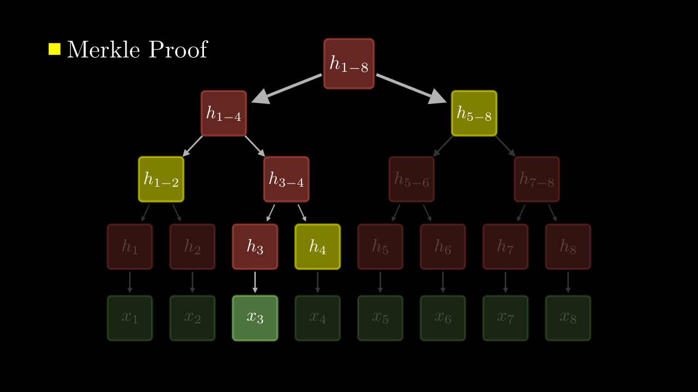

# Merkle Trees

## What is a Merkle Tree?

Simply put, a Merkle tree is a data structure that acts as a collision-resistant hash function with some interesting properties.

More specifically,

1. A Merkle tree can be viewed as a collision-resistant hash function that takes *n* inputs and outputs *Merkle root hash*.
2. A verifier that has only the root hash and any one of the inputs, say $x$, can be convinced that $x$ was actually one of the inputs
used to build the Merkle tree using a small-sized proof.

Now let's understand how Merkle Trees works?

## Construction of Merkle Tree

Let's say Bob is given $n$ inputs. For our example let's take $n = 8$.

To create a Merkle Tree, Bob follows the following steps-
1. In the first step, we hash each of the inputs using a collision-resistant hash function, say $H$.
2. In the next step, we concatenate adjacent hashes and hash it again using $H$. Now we are left with 4 hashes.
3. We repeat the last step until a single hash is left. This final hash is called the Merkle root hash.

Voila! 

In summary, the Merkle tree is a tree of hashes built bottom-up from its leaves.

Now that the Merkle tree is built, Bob's friend, Alice, wants to give one of the inputs, say $x_3$. And, Alice wants to be sure
that $x_3$ is the same input that Bob used to create the Merkle tree. This is where the Merkle Proof comes into the picture.

## Merkle Proof

Let's say that Alice was given the Merkle root hash using a trusted source and/or the root hash was digitally signed. But the data, $x_3$,
maybe transferred through an untrusted channel.

Now, Bob can send the **Merkle proof**, which will be enough to convince Alice that Bob has the same file.

*What is a Merkle proof?* Merkle proof is a small part of the Merkle tree which along with $x_3$ can be used to recompute the Merkle root hash.
The recomputed root hash can be verified with the trusted root hash.

So what part of the tree is included in the Merkle proof?

Remember that our goal is to recompute the hash at root. If you look at the path from $x_3$ to the root, at each level we concatenate the value 
at the current node with the sibling and hash the resultant. Thus, if we are only given the sibling hashes at each level we could recompute the root hash.

In the image below, the nodes marked in yellow will be part of the Merkle Proof and the red nodes will recomputed during the verification
step.

Merkle Proof, which is a set of hashes, may contain additional information about which branch, left or right, each hash value belonged to.

So, Merkle Proof for $x_3$ will look like:
{($h_4$, Right), ($h_{0-1}$, Left), ($h_{4-7}$, Right)}

You can see for yourself by running the *merkle_tree.r*s example in examples folder.

That's it! Now we understand how Merkle Tree is created and what Merkle Proof is.

If you want to read more about Merkle Trees, I highly recommend [What is a Merkle Tree?](https://decentralizedthoughts.github.io/2020-12-22-what-is-a-merkle-tree/#fn:consideredtobe) 
from which this article is based.
